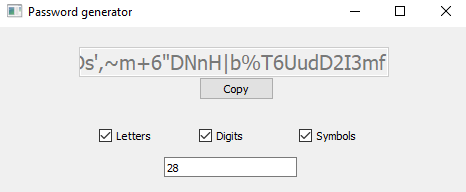

> [!NOTE]
> **📦 Archived — no longer maintained.**
> A beginner Python + Tkinter password generator from January 2020 — pick your character sets, set a length, get a password. Five commits over two days; it worked, and that was that.
> _Revisit if: honestly unlikely — kept as a record._

# passcode-gen

Generates strong and complex passwords, has the ability to customize the length of the password you want.
Options when you want to generate a password

- Letters, ABCDEFG
- Digits, 123567890
- Symbols, ^@?"{}&\*
- Length, minimum 8 characters. Maximum, well. Unlimited.

This is the GUI for the application, a very simple design:

